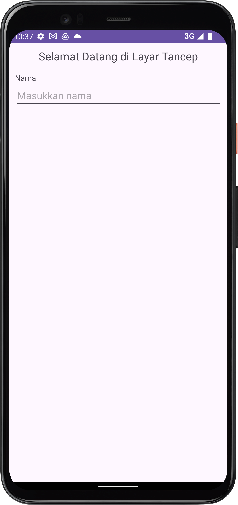
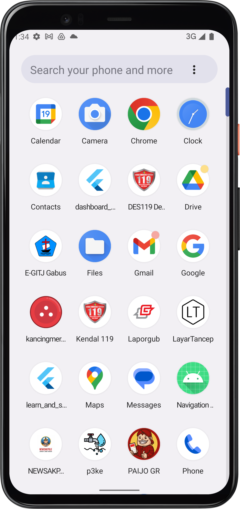
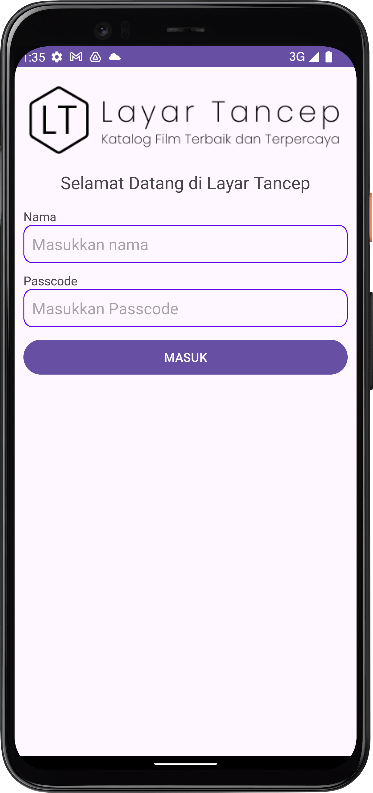
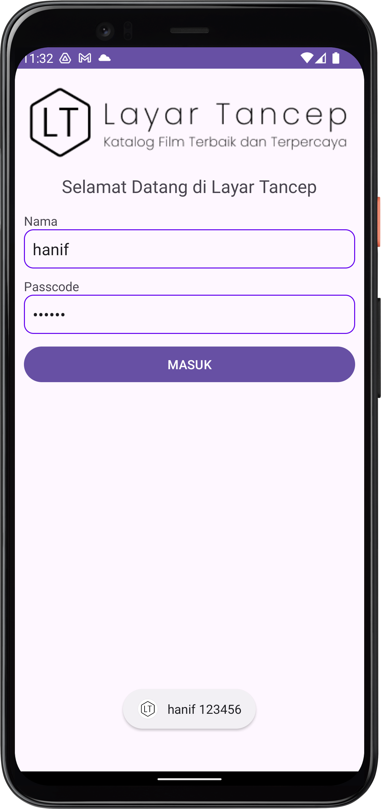
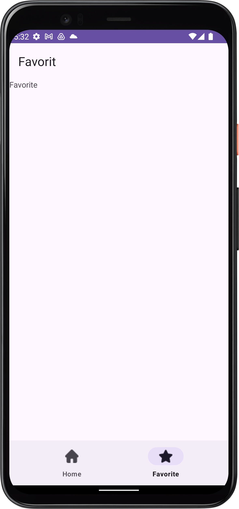

# Layar Tancep

Sebuah aplikasi yang dibuat untuk keperluan edukasi pada program Praktisi Mengajar.

Base Aplikasi : 

---

## Persiapan

[Slide Persiapan](https://docs.google.com/presentation/d/1pvxKh-CDFuJsItNDQAuTg56R-_CNLnyzEQBp5b9S-90/edit?usp=drive_link)

---

## Pertemuan 01

[Slide Pertemuan 01](https://docs.google.com/presentation/d/17T11WYyclq1kNkQYeKclWLQMSTKis2mLL5c6EoWd0GA/edit?usp=sharing)

Pada pertemuan 01 kita akan belajar memahami bagaimana struktur projek di Android Studio dan
bagaimana membuat atau mengatur tata letak beberapa tampilan.

- Struktur Projek di Android Studio
- Membuat Sebuah View
- Membuat Sebuah ViewGroup
- Menambah Gambar ke projek
- Mengganti Ikon Aplikasi
- Memberikan aksi pada sebuah View

| Gambar 1                 | Gambar 2                  | Gambar 3                  |
|--------------------------|---------------------------|---------------------------|
|  |  |  |

---

## Pertemuan 02

[Slide Pertemuan 02](https://docs.google.com/presentation/d/1Puaxs2Q098G12T55yoefbCwoalnZM9ZXbO02AhnP_hg/edit?usp=sharing)

Pada Pertemuan 02 kita belajar tentang penggunaan Activity dan Fragment. Selain itu juga belajar
bagaimana menambahkan library pihak ketiga ke dalam projek.

- Membuat sebuah Activity baru
- Mengubah Activity pertama yang dijalankan
- Menambahkan animasi menggunakan Lottie (https://lottiefiles.com/)
- Membuat beberapa Fragment baru
- Memanfaatkan BottomNavigation dan Navigation untuk menampilkan Fragment

| Gambar 1                  | Gambar 2                  | 
|---------------------------|---------------------------|
|  |  |